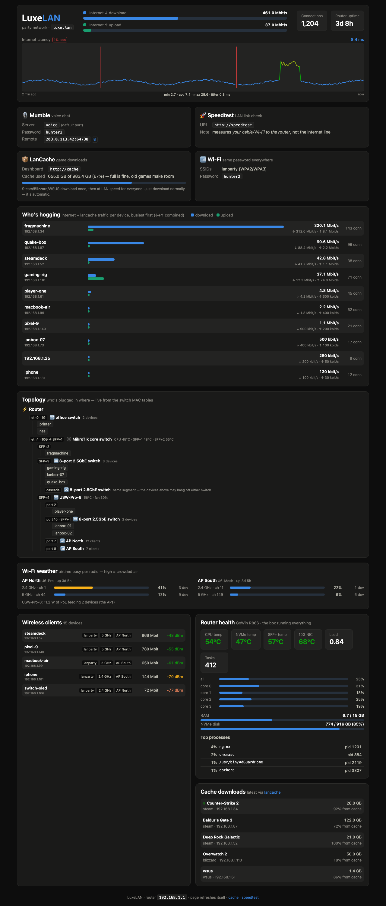

# lan-dash



A zero-dependency LAN-party dashboard served straight off an OpenWrt router.
One dark page at `http://luxe` (or whatever name you give it) that answers the
questions people actually ask at a party:

- **Is the internet OK?** — live WAN throughput gauges + a 2-minute ping graph
  (2 samples/sec) with hover tooltips, packet-loss bars, latency-colored line,
  and min/avg/max/jitter stats.
- **Who's hogging the connection?** — per-device download/upload rates and
  connection counts, derived from the kernel's conntrack table. Includes
  lancache traffic; sorted by combined rate.
- **Where do I connect?** — service cards (Mumble, speedtest, lancache
  dashboard, Wi-Fi credentials) with a copy button for the remote voice
  endpoint.
- **What does the network look like?** — a live topology tree built from
  MAC tables: router bridge FDB + managed-switch host tables + the UniFi
  controller. Devices appear under the switch/AP they're actually plugged
  into, with per-AP client counts and gear temperatures on each node.
- **Is the hardware happy?** — router CPU/RAM/load/disk, CPU + NVMe + SFP+
  module + NIC ASIC temperatures, top processes, Wi-Fi airtime utilization
  per radio, switch PoE draw and fan speed.

Everything renders from static JSON files: the collectors pre-compute
snapshots into `/tmp` and uhttpd serves them as plain files, so **nothing
computes per HTTP request** — dozens of clients polling every 500 ms–3 s cost
the router file reads only. The page is a single HTML file with vanilla JS
and CSS; no frameworks, no CDN, works when the uplink is down.

## Architecture

```
luxe-pinger  (procd, 2 pings/s)      ─► /tmp/luxe/ping.json    every 500 ms
luxe-statsd  (procd, 3 s loop)
  ├ /proc/net/nf_conntrack           ─► /tmp/luxe/net.json     per-IP rates, WAN, conns
  ├ /proc + /sys sensors             ─► /tmp/luxe/sys.json     CPU, temps, mem, disk
  ├ lancache-manager API  (~15 s)    ─► /tmp/luxe/cache.json   usage + downloads
  ├ UniFi controller API  (~15 s)    ─► /tmp/luxe/wifi.json    APs, clients, airtime
  ├ FDB + switch host tables (~15 s) ─► /tmp/luxe/topo.json    topology tree
  └ ethtool -m + hwmon + RouterOS    ─► /tmp/luxe/gear.json    SFP+/NIC/switch temps

uhttpd instance on a dedicated LAN IP alias, port 80
  web root: index.html + app.js + style.css + site.json
  data/ -> /tmp/luxe   (symlink; JSON served as static files)
```

Raw API dumps (which contain device secrets) land in `/tmp/luxe-raw`, which
is **not** served.

## Requirements

- OpenWrt router (tested on a GoWin R86S, x86_64 snapshot). Uses only what
  ships with OpenWrt: busybox, `ucode` (for JSON work — busybox can't),
  `brctl`, `ethtool`, procd, uhttpd.
- `coreutils-sleep` (`apk add` / `opkg install`) for the 2 Hz ping rate —
  without it the pinger automatically degrades to 1 sample/s. Note it must be
  invoked as `/bin/sleep` (ash runs `sleep` as a standalone applet and
  ignores PATH).
- Optional integrations, each skipped gracefully when unconfigured:
  - [lancache](https://lancache.net) + [lancache-manager](https://github.com/regix1/lancache-manager) in Docker
  - UniFi controller (APs / switch stats) in Docker
  - MikroTik switch with RouterOS v7 REST API (temps + host table)

## Install

```sh
cp config.sh.example config.local.sh      # credentials + network shape
cp www/site.json.example www/site.json    # passwords/addresses the page shows
$EDITOR config.local.sh www/site.json
./setup.sh     # one-time: packages, prerequisite checks, DNS name
./deploy.sh    # the dashboard itself; re-run after any edit
```

`setup.sh` installs `coreutils-sleep` + `ethtool` (apk or opkg), verifies
`ucode`/`brctl`/`uhttpd`/`br-lan`, and points your `DASH_NAMES` at the
dashboard — via the AdGuard Home API when `ADGUARD_URL` is set (instant, no
restarts), else as dnsmasq address records.

`deploy.sh` is idempotent and additive: it copies the files, pushes the
config to `/etc/luxe/config.sh`, adds the IP alias (live + uci, **no network
reload**), creates the uhttpd instance (restarts only uhttpd), enables the
daemons, and registers everything in `/etc/sysupgrade.conf`.

## Public (internet-facing) variant

The page supports a **public mode** that hides everything sensitive while
keeping all the live stats: set `"public": true` in a *separate* `site.json`
that contains no passwords, served from its own web root of symlinks:

```sh
mkdir www-public && cd www-public
ln -s ../www/index.html ../www/app.js ../www/style.css ../www/data .
printf '{"public": true, "mumble_remote": "lan.example.com"}\n' > site.json
```

Elements marked `lan-only` (credentials rows, Wi-Fi/speedtest cards,
internal links) disappear; the Mumble card shows only the public address.
Serve that root on a second uhttpd instance, port-forward WAN 80/443 to it,
and get a Let's Encrypt cert with the `acme` + `acme-acmesh` packages
(webroot HTTP-01 — note acme.sh appends `.well-known/acme-challenge` to its
webroot, so symlink `www-public/.well-known/acme-challenge` →
`/var/run/acme/challenge/.well-known/acme-challenge`, and add a
`/etc/hotplug.d/acme/50-uhttpd` hook that reloads uhttpd on renewal).
LAN clients keep the full dashboard: split-horizon DNS points the public
name at the alias IP internally, where ports 80/443 serve the private root.
**Pick the internal port for the public instance carefully** — check
`netstat -tln` first; on our router AdGuard Home was squatting the obvious
choice on a wildcard bind, which would have exposed its login page to the
internet.

## Field notes (hard-won, all verified on a live party network)

- `/proc/net/nf_conntrack` is a churning seq-file: occasional partial reads
  shed the table's tail. Byte counters only grow, so a negative per-host
  delta means "bad read", not "idle" — the collector holds the previous rate
  instead of publishing a zero tick.
- A stale UniFi session cookie returns `rc: ok` with an **empty device
  list** — indistinguishable from "all devices vanished". The sampler
  re-logins when the response has no `"type"` key.
- busybox `wget` can GET with URL credentials but cannot POST JSON: it
  hardwires `Content-Type: x-www-form-urlencoded` (RouterOS answers 415, and
  supplying the header yourself makes a duplicate → 400). The RouterOS
  monitor call is a raw `nc` request with held-open stdin instead.
- Docker containers on the default bridge cannot reach other LAN hosts on
  many OpenWrt firewalls (forwarding is docker→wan only) — query LAN devices
  from the host, not from a container.
- ash parameter expansion ends at the **first** `}`: `${VAR:-{}}` appends a
  stray brace to an already-set value. Corrupted-JSON defaults were the
  hardest bug in this repo.
- Unmanaged switches are invisible at L2. The topology infers them from MAC
  clustering and lets you name known ones (and known switch-behind-switch
  cascades) in the config — a cascade is one L2 segment, so device
  attribution between the two boxes is impossible in principle.

## Repo history note

This repo was exported as a single squashed commit from a private working
repo whose history contained real credentials. If you fork the idea, keep
your own `config.local.sh` / `site.json` out of git from day one.
